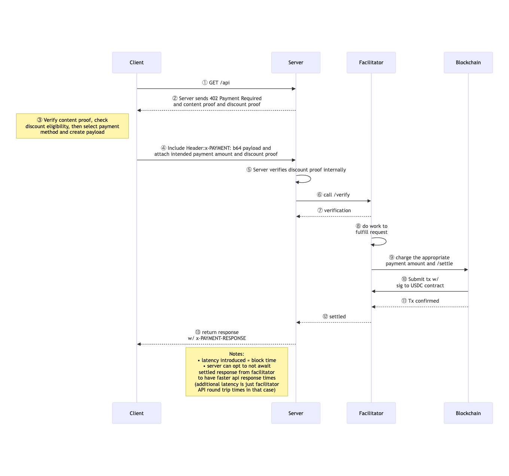

# ETHGlobal Buenos Aires 2025 zkx402 - x402 protocol extension

# zkx402 - Proof of Leak
Verifiable leaks. Anonymous monetization. AI-native access.

## Summary
zkx402 is the extension that incorporates privacy into x402 protocol. ProofOfLeak is the first place that utilizes zkx402 extension and lets whistleblowers securely sell sensitive private data to journalists and AI agents with cryptographic guarantees of authenticity, optional identity verification for discounted pricing, and native x402 payments so AI agents can autonomously buy leaks on behalf of their humans.

Whistleblowers get paid without ever revealing their identity.
Journalists get cheaper access by proving they are human and work for reputable outlets.
Journalist-controlled AI agents pay autonomously via x402 on Base to access private sensitive data.

We’re SecureDrop + ZK provenance + dynamic pricing + AI agent economy in one protocol.

## High-level abstract & value proposition

### Consumers (Journalists & AI Agents)
- Variable pricing based on verified identity (50% discount for verified parties)
- Eligibility proven via zkproofs, no trusted third party needed
  - Human journalists → Self.xyz, Worldcoin, zkPassport, or vLayer org proofs (NY Times, The Economist, etc.)
  - AI agents get the proof of humanity from the human to be eligible for the discounted price
  - Unverified → pay full price ($0.02 instead of $0.01)

### Producers (Whistleblowers)
- ZK-verified metadata & content provenance (vlayer ZK Email / zkTLS)
- Prove insider status, document authenticity, creation timestamp without revealing identity
- Optional partial identity reveal (e.g. date of birth + country via Self.xyz if journalist already knows who the source is)
- Get paid instantly in USDC on Base while staying fully anonymous

This creates the missing economic layer for truth.

## User Flows

### Whistleblower Flow
1. Upload sensitive document/photo bundle
2. Generate vLayer ZK proof (ZK Email or zkTLS) → proves insider access + authenticity + creation date
3. Content encrypted + stored on IPFS
4. Listing goes live with "Verified Insider" badge
5. Receive USDC instantly when sold

### Journalist (Human) Flow
1. Connect embedded wallet (Coinbase Smart Wallet on Base)
2. Optional: Verify credentials via vLayer (e.g. prove employment at NY Times/The Economist) or Self.xyz
3. Browse leaks → verified journalists see $0.01 price, others $0.02
4. Pay with one click → receive decrypted content + ZK proof bundle

### AI Agent Flow (the nuclear demo)
1. Journalist delegates discount via EAS attestation on Base (ERC-8004 pattern)
2. Agent wallet pre-approved $5 budget
3. Agent calls MCP/x402 endpoint → server checks attestation → returns 402 with $0.01 amount
4. Agent pays autonomously → receives content + delivery proof
5. Demo shows agent buying 20+ leaks in 15 seconds while journalist drinks mate

## Tech Stack
### Frontend app
- Frontend: Vite + React + TypeScript + ShadCN UI + Tailwind CSS + React Router
- UI Components: Radix UI primitives (Dialog, Accordion, Dropdown, etc.)
- Forms: React Hook Form + Zod validation
- Data Fetching: TanStack Query (React Query)
- Charts: Recharts
- Icons: Lucide React

### zkx402 payment
- Frontend: Next.js 14 + React + TypeScript
- Wallet & Auth: Coinbase CDP (Embedded Wallet with email/SMS/OAuth login)
- Payments:
   - Client → x402-fetch (HTTP 402 payment client)
   - Server → x402-express + @coinbase/x402 (payment middleware & facilitator)
   - Token → USDC on Base Sepolia
- Backend: Express.js + Node.js + CORS
- APIs: CDP Faucet API + CDP Token Balances API
- Chain: Base Sepolia testnet (chainID: 84532)

## Demo Flow
1. Whistleblower uploads "Epstein 2025 Flight Logs.pdf" → vLayer ZK Email proof shows sent from epstein@lol.gov → "Verified Insider" badge appears
2. Verified NY Times journalist connects → sees $0.01 price (vs $0.02 for random wallet)
3. Pays → gets content + proof bundle
4. Same journalist delegates discount to AI agent via one-click EAS attestation
5. Run agent script → autonomously buys every leak under $0.02 in a loop
6. Show transaction history: agent spent $0.37 building the next Pandora Papers overnight

## Future Work
How the project can be built further:
- Build MCP server for the leaked contents so that AI agents can consume it

## Deployed contract (all verified)
### Base Sepolia testnet (chainID: 84532)
| Contract    |                           Contract address |
| Self smart contract |  |
| USDC (testnet)   | 0x036CbD53842c5426634e7929541eC2318f3dCF7e |
The verified smart contract on Base Sepolia testnet is:

https://sepolia.basescan.org/address/0x036CbD53842c5426634e7929541eC2318f3dCF7e#code


### Celo Alfajores testnet (chainID: 44787)
| Contract    |                           Contract address |
| Self smart contract |  |
The verified smart contract for Celo testnet is:


## How to run locally
### Frontend
Go to the "frontend" folder and run these commands:
```bash
cd frontend
npm install
npm run dev
```
### Backend
For backend, go to the "backend" folder and run these commands:
```bash
npm install
npm run dev
```

## Demo movie


## Demo site
