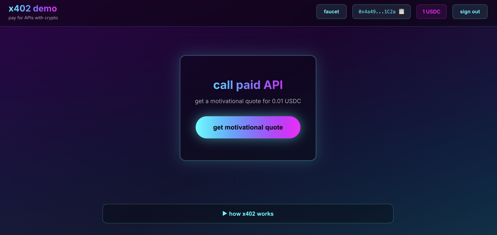

# x402 demo



this is a simple demo of the x402 payment protocol, showcasing how easy it is to add crypto payments to any API and how seamlessly clients can pay for access

## what is x402?

[x402](https://www.x402.org/) is an HTTP-based payment protocol that enables instant, automatic stablecoin payments for APIs and digital content

it revives the HTTP 402 "Payment Required" status code to enable programmatic payments without accounts, sessions, or complex auth

x402 is perfect for:
- AI agents paying for services
- micropayments and pay-per-use APIs
- monetizing web services without subscription-based paywalls
- instant settlement without intermediaries

## about this demo

this project showcases **four Coinbase Developer Platform (CDP) products** working together:

### CDP products used

**client-side:**
- **CDP Embedded Wallet** - seamless user auth with a variety of web2-friendly auth methods; no extension or seed phrases

**server-side:**
- **CDP x402 Facilitator** - payment verification and blockchain settlement
- **CDP Faucet API** - one-click test USDC distribution
- **CDP Token Balances API** - realtime USDC balance checking

### what you'll see

- simple API endpoint requiring 0.01 USDC payment
- multiple web2-friendly auth options for wallet creation
- one-click faucet for test USDC
- automatic payment handling (no manual transaction signing)
- real-time balance updates via CDP API
- transaction confirmations on Basescan

## quickstart

### pre-reqs

1. **Node.js v18+** installed
2. **CDP Project** created at https://portal.cdp.coinbase.com/
3. **CDP API Key** for using CDP Facilitator, Faucet API, and Token Balances API
4. **wallet address** to receive payments (any Ethereum address)

### 1. install server dependencies

```bash
cd server
npm install
```

### 2. configure server

```bash
cp .env.example .env
```

edit your `server/.env`:
```env
RECEIVER_WALLET=0xYourWalletAddressHere
CDP_API_KEY_ID=your-api-key-id
CDP_API_KEY_SECRET=your-api-key-secret
PORT=3001
```

**get CDP API credentials:**
1. go to https://portal.cdp.coinbase.com/
2. navigate to API Keys
3. create new API key
4. copy the ID and Secret

### 3. start server

```bash
npm run dev:server
```

you should see:
```
🚀 x402 Demo Server running on http://localhost:3001
📝 Protected endpoint: http://localhost:3001/motivate
💰 Receiving payments at: 0xYourAddress
```

leave this terminal running

### 4. install client dependencies

open a new terminal:

```bash
cd client
npm install
```

### 5. configure client

```bash
cp .env.local.example .env.local
```

edit your `client/.env.local`:
```env
NEXT_PUBLIC_CDP_PROJECT_ID=your-project-id-here
NEXT_PUBLIC_API_URL=http://localhost:3001
```

**get your CDP Project ID:**
1. go to https://portal.cdp.coinbase.com/
2. select your project from the dropdown
3. go to Settings
4. copy the Project ID

### 6. start client (in a new terminal)

```bash
npm run dev:client
```

you should see:
```
✓ Ready in 2.5s
○ Local:        http://localhost:3000
```

### 7. try it

1. open http://localhost:3000
2. click "Connect Wallet" and choose your preferred sign-in method
3. complete authentication; CDP Embedded Wallet is created automatically
4. click "Faucet" to get free testnet USDC
5. click "Get Motivational Quote (0.01 USDC)"
6. watch the payment happen automatically
7. see your quote and transaction confirmation on Basescan

## project structure

```
x402-demo/
├── server/              # express API with x402
│   ├── index.js         # main server with x402 middleware
│   ├── faucet.js        # CDP Faucet API integration
│   ├── balances.js      # CDP Token Balances API integration
│   ├── package.json
│   └── .env.example
├── client/              # Next.js web app
│   ├── app/
│   │   ├── page.tsx           # main UI with auth & payments
│   │   ├── providers.tsx      # CDP Embedded Wallet setup
│   │   ├── layout.tsx
│   │   └── globals.css
│   ├── package.json
│   └── .env.local.example
└── README.md            # this file
```

## x402 server-side integration

this is literally all the code needed to add payments to your API:

```javascript
import { paymentMiddleware } from "x402-express";
import { facilitator } from "@coinbase/x402";

app.use(paymentMiddleware(
  "0xYourWalletAddress",  // your wallet where you'll receive payments for your API
  {
    "GET /motivate": {
      price: "$0.01",              // how much you want to charge
      network: "base-sepolia",     // blockchain network
      // asset: "0x036CbD...",     // optional: specify token (defaults to USDC)
    }
  },
  facilitator  // CDP's hosted facilitator (requires CDP API key)
));

app.get("/motivate", (req, res) => {
  res.json({ quote: "Work hard, have fun, make history." });
});
```

the **CDP x402 Facilitator** handles:
- payment verification (validates EIP-3009 signatures and amounts)
- blockchain settlement (submits to the indicated chain; pays gas fees on supported chains)
- error handling and retry logic
- adding response headers with transaction details

**note on tokens:** the `price: "$0.01"` shorthand defaults to USDC

**EVM limitation:** On EVM chains (like Base), x402 uses EIP-3009 `transferWithAuthorization`, which requires tokens to explicitly implement this standard. Most ERC20 tokens have not implemented EIP-3009, so in practice this limits x402 in its current form to using mostly USDC.

**Solana flexibility:** On Solana, x402 works with **any SPL token** using standard token transfers with facilitator fee sponsorship - no special token implementation required

## x402 client-side integration

making a paid request from your app's front-end is incredibly simple with CDP's new `useX402` hook:

```typescript
import { useX402 } from "@coinbase/cdp-hooks";

// one line to get payment-enabled fetch
const { fetchWithPayment } = useX402();

// make paid request; payment happens automatically
const response = await fetchWithPayment("http://localhost:3001/motivate");
const data = await response.json();
```

the **`useX402` hook** from CDP Embedded Wallet automatically:
- detects 402 responses from the server
- extracts payment information
- creates payment transactions
- signs with your CDP Embedded Wallet
- retries with proof of payment
- returns the paid content

## how x402 works

```
┌─────────┐                    ┌─────────┐                    ┌────────────┐
│ Client  │                    │  Server │                    │ Facilitator│
└────┬────┘                    └────┬────┘                    └─────┬──────┘
     │                              │                                │
     │  1. GET /motivate            │                                │
     ├─────────────────────────────>│                                │
     │                              │                                │
     │  2. 402 Payment Required     │                                │
     │     + Payment Requirements   │                                │
     │<─────────────────────────────┤                                │
     │                              │                                │
     │  3. Create & Sign Payment    │                                │
     │     Transaction              │                                │
     │                              │                                │
     │  4. GET /motivate            │                                │
     │     + X-PAYMENT header       │                                │
     ├─────────────────────────────>│                                │
     │                              │  5. Verify Payment             │
     │                              ├───────────────────────────────>│
     │                              │                                │
     │                              │  6. Verification Result        │
     │                              │<───────────────────────────────┤
     │                              │                                │
     │                              │  7. Settle Payment             │
     │                              ├───────────────────────────────>│
     │                              │                                │
     │                              │  8. Settlement Result          │
     │                              │     + Transaction Hash         │
     │                              │<───────────────────────────────┤
     │                              │                                │
     │  9. 200 OK                   │                                │
     │     + Protected Content      │                                │
     │     + X-PAYMENT-RESPONSE     │                                │
     │<─────────────────────────────┤                                │
     │                              │                                │
```

## suggested demo presentation flow

1. **show server code** (`server/index.js`)
   - show how simple the integration is
   - point out the 3 lines of x402 config
   - explain the endpoint just returns data normally

2. **start server**
   - run `npm run dev:server`
   - show it's just a normal Express server

3. **show client UI** (http://localhost:3000)
   - connect or create wallet
   - request faucet funds
   - show how the displayed balance updates

4. **make paid request**
   - click "Get Motivational Quote"
   - show the loading state
   - point out payment happens automatically
   - show the quote appears
   - show transaction on BaseScan

5. **explain what's happening**
   - first request got a 402 payment required from the API server
   - client created EIP-3009 payment, signed with CDP Embedded Wallet
   - client retried request with X-PAYMENT header
   - server called **CDP x402 Facilitator** to verify payment
   - **CDP Facilitator** verified signature and settled payment onchain
   - server returned paid content with transaction details

## why x402 matters

### for devs
- easily monetize APIs, adding payments with just a few lines of code
- no complex blockchain integration; facilitator handles all that
- no managing private keys or gas
- works with existing HTTP infra

### for users
- no accounts or subscriptions
- pay only for what you use
- instant access
- transparent pricing

### for agents
- programmatic payment without human intervention
- discover and pay for services autonomously
- no API keys or authentication needed

## CDP products in this demo

this demo uses **four CDP products**:

| CDP product | purpose | used in | auth details |
|-------------|---------|---------|---------------|
| **Embedded Wallet** | user auth & wallet creation | client | CDP Project ID only |
| **x402 Facilitator** | payment verification & settlement | server | CDP API Key |
| **Faucet API** | distribute testnet USDC | server | CDP API Key |
| **Token Balances API** | check USDC balances | server | CDP API Key |

CDP products work together seamlessly - the server uses one CDP API key to access the Facilitator, Faucet, and Token Balances APIs, while the client uses a CDP Project ID for Embedded Wallet creation & auth

## learn more

- [CDP Facilitator docs](https://docs.cdp.coinbase.com/x402)
- [CDP Embedded Wallet docs](https://docs.cdp.coinbase.com/embedded-wallets)
- [CDP x402 Facilitator API reference](https://docs.cdp.coinbase.com/api-reference/v2/rest-api/x402-facilitator/x402-facilitator)
- [x402 GitHub repo](https://github.com/coinbase/x402)

## license

MIT